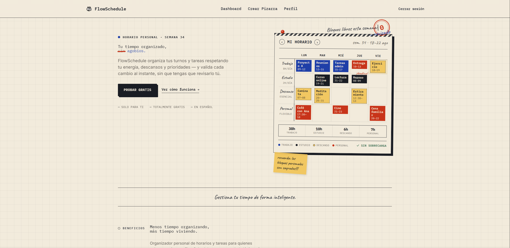
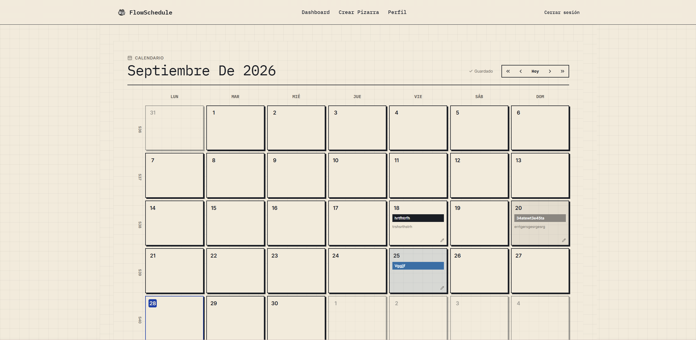
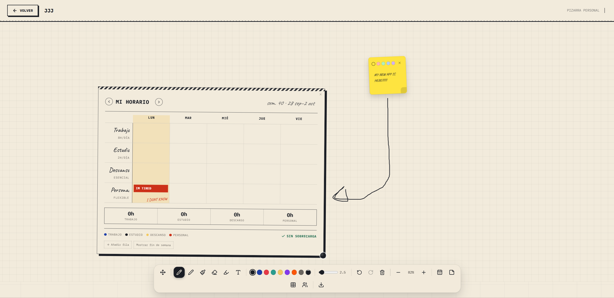

# FlowSchedule

A healthcare shift management system focused on personnel scheduling and organizational tools.

**Live demo:** https://flowscheduler.onrender.com

---

## Overview

FlowSchedule is a project built to explore Domain-Driven Design (DDD) and Hexagonal Architecture within the Laravel ecosystem. The goal is to separate core business logic (like shift validation rules) from the framework, making the system easier to test and maintain.

## Current Status

### ✅ Implemented
- **User Auth**: Full registration, login, and profile management.
- **Shift Creation**: Ability to define medical shifts (Morning, Afternoon, Night) with required skills.
- **Organization Tools**:
  - **Kanban Boards**: Full CRUD for collaborative task boards.
  - **Todos**: Task management integrated with boards.
  - **Calendar**: Personal event tracking and management.
- **Scheduling Engine**: A domain service that validates shifts against business rules (minimum rest, max hours, and skill matching).
- **Onboarding**: Initial setup flow for new users.
- **API Tokens**: Personal access token management for API access.

### 🚧 In Progress
- **Shift Assignments**: The architecture for assigning employees to shifts is defined (entities/ports), but the business logic is currently being implemented.
- **Team Management**: Basic database structure for teams exists, but management features are in early development.

### 💡 Planned
- **Automated Assignment**: Logic to automatically match the best employee to a shift based on skills and fairness.
- **Shift Trading**: A system for staff to swap shifts.
- **Notifications**: Real-time alerts for new assignments or changes.

## Architecture

The project uses a Hexagonal approach to keep the domain logic pure.

```
flowscheduler/
├── app/                      # Laravel framework glue
├── src/Bundle/FlowScheduler/  # Core Business Logic
│   ├── Application/          # Use cases (e.g., CreateShift, RegisterUser)
│   ├── Domain/               # Pure logic (Entities, Enums, ValueObjects)
│   │   ├── Entities/         # Shift (Implemented), Employee (Stub)
│   │   ├── Services/         # SchedulingValidator (Real business rules)
│   │   └── ValueObjects/      # TimeSlot, ShiftId, InviteCode (Validated)
│   ├── Infrastructure/        # Technical details (DB, Auth)
│   └── UI/                   # Presentation (Controllers)
├── database/migrations/       # DB Schema
└── tests/                     # Unit & Feature tests
```

## Tech Stack

| Layer | Technology |
|---|---|
| **Backend** | Laravel  (PHP 8.3) |
| **Frontend** | React, Tailwind CSS, Vite , CSS , Brave |
| **Database** | PostgreSQL (via Supabase) |
| **Infrastructure** | Docker, Nginx, Render |
| **Testing** | PHPUnit |

## Getting Started

1. **Clone & Install**
   ```bash
   git clone https://github.com/benjaminomosefeking-ops/FlowSchedule.git
   composer install
   npm install
   ```

2. **Environment**
   ```bash
   cp .env.example .env
   php artisan key:generate
   ```

3. **Database**
   Configure your `.env` with PostgreSQL credentials and run:
   ```bash
   php artisan migrate
   ```

4. **Run**
   ```bash
   npm run dev
   php artisan serve
   ```

## Testing

The project includes a comprehensive test suite covering authentication, domain rules, and API endpoints.

```bash
php artisan test
```

## Screenshots

### Dashboard


### Create Shift


### Login


## What I Learned

- **DDD in Practice**: How to move business logic out of Controllers and into Use Cases and Domain Services.
- **Hexagonal Design**: Implementing "Ports and Adapters" to decouple the core from the database and framework.
- **Strict Validation**: Using Value Objects to ensure data integrity before it even reaches the service layer.

## Author

Benjamín Omosefe King
GitHub: @benjaminomosefeking-ops

## License

MIT
